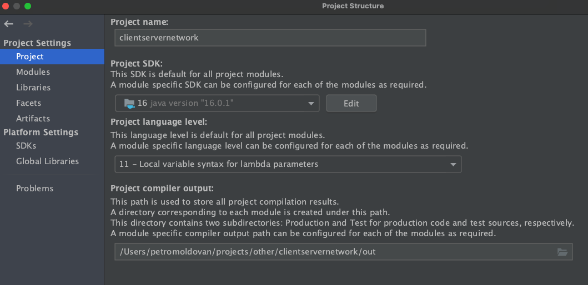
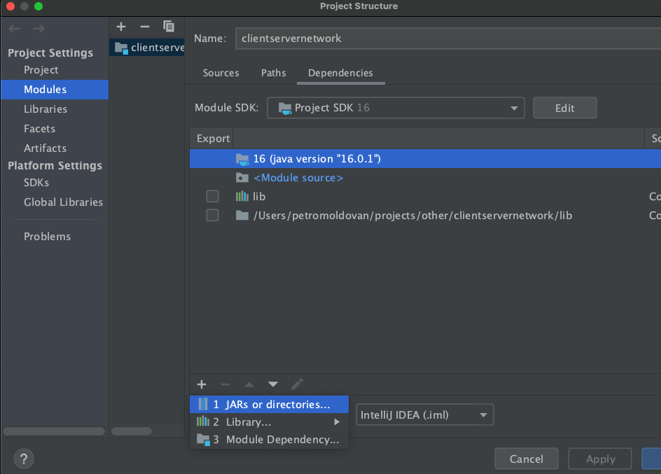
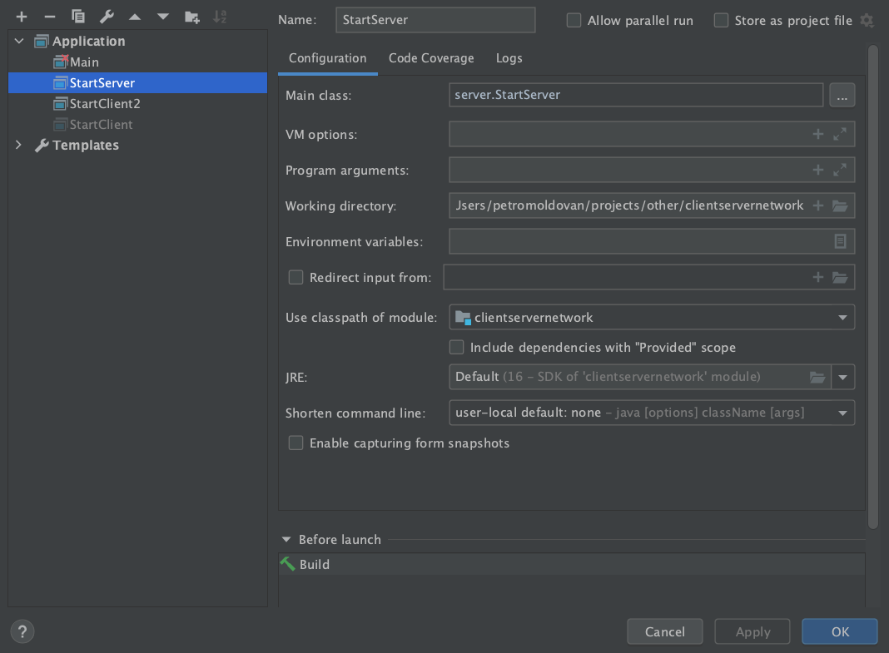
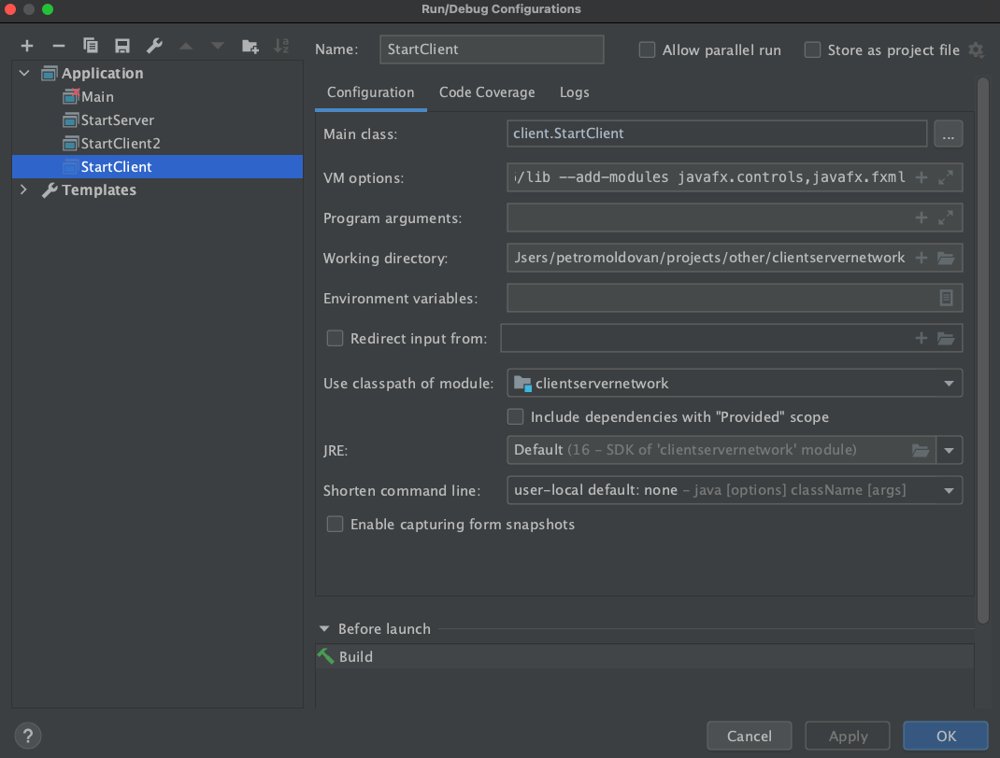

Requirements
--------
* Java 11+
* Java SDK 16
* Javafx SDK 16


Setup IntelliJ IDEA
--------
1. Set Java SDK version in File -> Project Structure -> Project


2. Link project third party libraries in File -> Project Structure -> Modules -> Dependencies


Then select `lib` folder in the root of the project.

3. Configure server runner


4. Configure clients
VM line:
```
--module-path /YOUR/PATH/TO/JavaFX-lib/javafx-sdk-16/lib --add-modules javafx.controls,javafx.fxml
```

